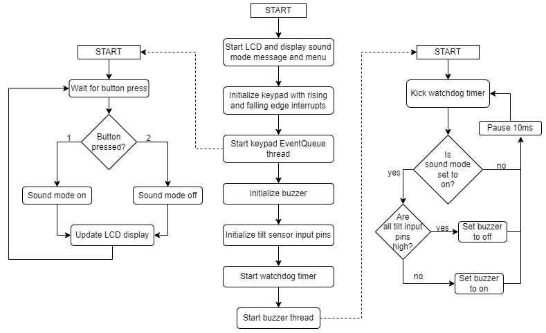
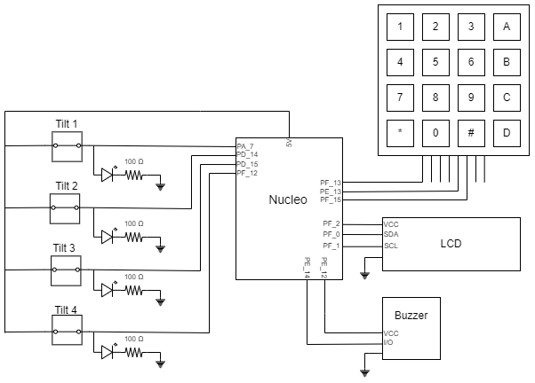

# 
cse321-project-3

Timothy Erckert

*This markdown file is included in my [repository](https://github.com/terckert/cse321-project-3). Some external file links and images may not work if not viewed from outside of the repo.*

## Table of Contents

- [cse321-project-3](#cse321-project-3)
	- [Table of Contents](#table-of-contents)
	- [About](#about)
	- [Program Overview](#program-overview)
	- [Features](#features)
	- [Required Materials](#required-materials)
	- [Getting Started](#getting-started)
	- [Resources and References](#resources-and-references)
		- [External References](#external-references)
		- [Files](#files)
			- [lcd1602.cpp | lcd1602.h](#lcd1602cpp--lcd1602h)
		- [Declarations (Global Variables)](#declarations-global-variables)
		- [APIs and Peripherals](#apis-and-peripherals)
			- [InterruptIn](#interruptin)
			- [DigitalIn](#digitalin)
			- [Watchdog](#watchdog)
			- [Mutex](#mutex)
			- [EventQueue](#eventqueue)
			- [Thread](#thread)
			- [DigitalOut](#digitalout)
			- [Keypad](#keypad)
			- [LCD](#lcd)
			- [LEDs](#leds)
			- [Tilt Sensors](#tilt-sensors)
			- [Buzzer](#buzzer)
		- [Custom functions](#custom-functions)
	- [Program flowchart](#program-flowchart)
	- [Schematic](#schematic)

## About
This project is a prototype of a device that will "save the world!" It's purpose is to help someone hone their fine motor skills. A simple digital level with LED and sound alarms to alter a user when it has begun tipping to far foward, backward, left, or right. They can use these indicators to bring it back to level.

## Program Overview
Program will use 4 tilt sensors bent towards the four cardinal directions (with relation to the whiteboard, not magnetic) to detect whether what it has been placed on is level or not. LED's will be lit by default and will dim when skewed in that direction. This will also sound an alarm from the onboard buzzer. When the board has been brought back to level state, all lights will be lit once more and alarm will turn off.

The user has the option to silence the alarm feature by pressing 2 on the keypad, and can reactivate it by pressing 1. These options are displayed on the LCD screen. 

## Features
1. LCD screen menu
2. Visual and auditory alerts
3. Keypad input
4. Detects tilt when placed on a carried obect

## Required Materials
| Quantity | Item                                                  |
| :------: | ----------------------------------------------------- |
|    1     | Nucleo STM32L4R5ZI                                    |
|    1     | 1602 LCD                                              |
|    4     | 100ohm resistors                                      |
|    4     | LEDs                                                  |
|    1     | 4x4 Membrane Keypad                                   |
|    1     | Solderless breadboard                                 |
|    4     | Gikfun Metal Ball Tilt Shaking Position Switches      |
|    1     | Arceli Passive Low Level Trigger Buzzer Alarm, 3.3-5v |
|          | Female-to-male jumper wires                           |
|          | Male-to-male jumper wires                             |

## Getting Started

To use the program the circuit must be built as detailed in the [schematic section](#schematic) or by following pinout tables in peripheral sections. 

*It is **important** that when you are adding the tilt sensors they should be bent in the direction that they are going to be checking. I found the easiest way is inserting them into the breadboard and then pushing them outwards. Through testing, I have found an angle of 30-40 degrees works best, but you can bend them to whatever angle words best for you.*

<strong>Build</strong>
1. Create a new project in Mbed Studio and include the following files:
    - lcd1602.cpp
    - lcd1602.h
    - CSE321_project2_terckert_main.cpp
1. Attach Nucleo to PC and build project or build binary and manually add to Nucleo memory.
1. Enjoy!

## Resources and References

### External References
- [Project Repository](hhttps://github.com/terckert/cse321-project-3)
- [Nucleo API documentation](https://os.mbed.com/docs/mbed-os/v6.15/apis/index.html)
- [Nucleo Reference Manual](https://www.st.com/resource/en/reference_manual/dm00310109-stm32l4-series-advanced-armbased-32bit-mcus-stmicroelectronics.pdf)

### Files

#### lcd1602.cpp | lcd1602.h
- Contains all the logic and functions necessary to use the LCD

### Declarations (Global Variables)

### APIs and Peripherals
#### InterruptIn
Sets a pin as an interrupt. Program uses the following functions:
1. rise
    
    Sets the rising edge callback function.
1. fall
    
    Sets the falling edge callback function.

#### DigitalIn
Sets a pin to read in a high or low signal. These pins are used to detect input from the tilt sensors. They transmit a 1 when level and a 0 when skewed.

|Variable Name|Pin|
|---|:------:|
|tilt_sensor_1|PA_7|
|tilt_sensor_2|PD_14|
|tilt_sensor_3|PD_15|
|tilt_sensor_4|PF_12|

#### Watchdog

An internal timer that resets the microcontroller when a timer reaches 0.

1. get_instance
   
   Initializes watchdog timer.

2. start

   Starts the watchdog timer with the specified timeout period.

3. kick
   
   Resets the watchdog timers timout period.

#### Mutex

Controls access to critical regions. A program will spin until it is able to acquire the lock, preventing it from continuing.

1. lock
   
   Locks the mutex, preventing another thread from acquiring it and progressing.

2. unlock
   
   Unlocks the mutex, allowing another thread to acquire it.

#### EventQueue

A function queue that allows multiple interrupts or threads to add to it. It is executed sequentially in a first in, first out style. It helps to control access to critical regions and also allows interrupts the ability to call blocking functions or functions could otherwise be corrupted.

1. call

	Calls an event from the queue.

#### Thread

Allows for parallel execution of tasks. 

1. start
   Starts a new thread. Calls a function and passes in parameters relevant to its execution.

#### DigitalOut

Allows writing high or low to a Nucleo pin.

#### Keypad
The keypad row pin is constantly energized to capture input. When pressed, 1 and 2 will send an interrupt signal to queue a function to change sound modes.

| Row output pin | Nucleo pin |
|---|:---:|
| Row: 1,2,3,A | F13 |

| Column input pin | Nucleo pin|
|---|:---:|
| Column: 1,4,7,* | E13 |
| Column: 2,5,8,0 | F15 |

#### LCD

[1602 LCD Datasheet](/1602_LCD_Datasheet.pdf)

[LCD controller class header file](/lcd1602.h)

Control logic for the LCD screen. Program uses the following functions:
1. begin
    
    Setup logic for the LCD. Sets needed registers to get the LCD to display text.

1. clear
    
    Clears the LCD screen.

1. setCursor
    
    Sets the cursor to the designated spot on the LCD screen.

1. print
    
    Prints the desired string to the LED.

| LCD pin | Nucleo pin |
|---|:---:|
| SDA | F0 |
| SCL | F1 |
| VCC | F2 |
| GRD | GRD |
#### LEDs

LEDs are on by default when the tilt sensor is level. They turn off when the sensor detects tilt.

#### Tilt Sensors

Tilt sensors are simple switches controlled by a ball that is free to move inside the casing. They transmit high when the ball is seated at the base and low otherwise.

| Sensor | Nucleo Pin |
| --- | :---: |
| Tilt Sensor 1 | A7 |
| Tilt Sensor 2 | D14 |
| Tilt Sensor 3 | D15 |
| Tilt Sensor 4 | F12 |

#### Buzzer

The buzzer is active low, meaning it sounds when the I/O pin is set to low. The buzzer is controlled by software which checks the inputs of all 4 tilt sensors. If any sensor input is low, buzzer sounds. When all are high, alarm is off.

| Buzzer Pin | Nucleo Pin |
| --- | :---: |
| VCC | E12 |
| I/O | E14 |
| GRD | GRD |

### Custom functions

[Custom functions can be found here](CSE321_project3_terckert_main.cpp)

1. initialize_1602

	Provides power to the lcd and calls the LCD begin function, which initialize the LCD for use.

1. debounce_falling_edge

	Debounces on the falling edge by waiting. Wait time is determined by physically testing thekeypad and a different keypad may have a different sweet spot.

1. process_column_one_interrupt

	Rising edge interrupt for column one. Debounces rising edge with a wait. Queues functionto change sound mode with a sound_on parameter

1. process_column_two_interrupt

	Rising edge interrupt for column one. Debounces rising edge with a wait. Queues functionto change sound mode with a sound_off parameter. 

1. change_sound_mode

	Added to an EventQueue by the keypad interrupts, this function will change the currentsound mode, allowing or restricting use of the buzzer as an auditory alert.

1. check_tilt_sensors

	The main loop of the buzzer peripheral. Polls the inputs from the tilt sensors every10ms to determine if a sensor has detected tilt. This function also handles the watchdogtimer logic. If unable to aquire the buzzer_lock mutex within 120ms, it will restart theprogram. This value was chosen based on the scenario that both a rising and falling edgeinterrupt paused the program for 50ms each at the start of a pole cycle.

## Program flowchart

## Schematic

